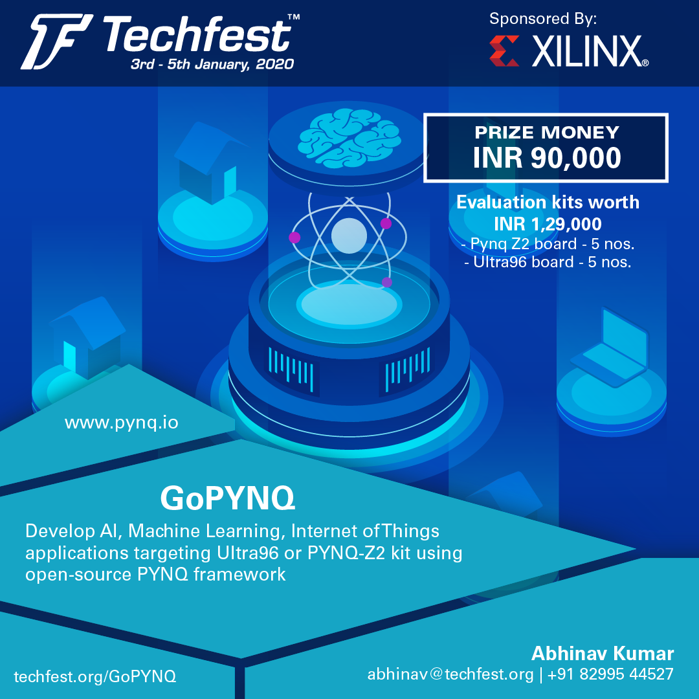

# “GO PYNQ” 
- Contest Sponsored by Xilinx for Kshitij’2019

## Moto
To build an application using Python in conjunction with the Xilinx PYNQ
platform and share back to the PYNQ Community.

## Application Choices - Using PYNQ
Depends on your creativity, e.g. IoT, Video Processing, Any compute heavy
workload being accelerated.

## Prizes

The best performers will be awarded with various tokens of appreciation from Xilinx.
These items are listed below.

1. Top three best apps will be awarded

    - **First prize of Rs 45,000/-**
    - **Second prize of Rs 30,000/-**
    - **Third prize of Rs 15,000/-**
    
2. Consolation cash prize for every shortlisted idea which is then showed
to be working on hardware too.

3. *Icing on the cake is that the shortlisted teams get to keep the PYNQ-Z2 board!*

## Guidelines

1. Form a team (of Max 4)
2. Come up with an idea to solve a problem
3. Write up an abstract:
    a. Demographics: Team name, Branch, College, Team members skills background etc.
    b. A single page to describe: Problem statement, Solution proposed (Include Python code compiled on CPU at this stage) 
    c. Supporting Block Diagrams (if needed) – limited to 2 diagrams
4. Abstract entries will be evaluated at Xilinx and around 10 teams will be shortlisted. The shortlisted Institute will be receiving PYNQ-Z2 platform board (based on a request from an Institute/Prof/Dept) – in order to take the ideas onto hardware
5. Shortlisted teams would be required to bring their idea to life using PYNQ. Submit a 2 minute YouTube (or similar) video of your project. Working source code with results also to be pushed to Github on or before **13th Jan’2019**.
6. The submitted apps will be evaluated based on the judging criteria and winners will be announced on the finale event of Kshitij’2019

## Required Skills

- Creative Problem Identification
- Python (working knowledge)
- Domain Knowledge (of the problem space identified)
- Hardware Knowledge (to be able to understand hardware resources available on PYNQ)

## Schedule

| Level | Task | Deadline |
| --- | --- | ------ | 
| 1   | Abstract Submission | 15th Nov'18|
| 2   | Abstract Acceptance Notification| 30th Nov'18|
| 3   | Final Source Code Submission | 13th Jan'19|
| 4   | Winners Declaration | On Kshitij'19 Fest|

## Judging Criteria

| | Score (1-10) | Criteria | Description |
| --- | --- | --- | --- |
| Idea | 10 | Creativity | How creative or innovative is the idea behind the design? |
| | 10 | Viability | How relevant is the design's use case to a real problem? Is the python code working on CPU in the first place? |
| Open Source and Reproducible | 10 | Open-Source | Are build steps provided, python packaged, available on Github as notebook and source code. |
| | 10 | Reproducible | Could someone reproduce this work starting from a pynq v2.3 image and going through their notebook. |
| Implementation | 10 | Feasibilty | Does it actually work? |
| | 10 | Uniqueness | How well does the app leverage a variety of different open-source APIs and programmable logic? |

- Abstract Evaluation will be judged on Idea category only.
- The shortlisted abstracts will be judged on remaining categories.

## Support

- PYNQ being open sourced project of Xilinx, much of the information is available online: http://www.pynq.io/
- Checkout the Presentations and Quickstart sections in this repo
- One pre-determined slot one hour per week, given by Xilinx Employee for support/brainstorming 
